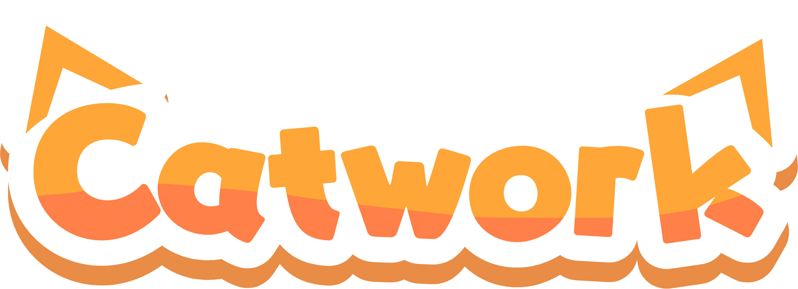

<div align="center">
</img>
<h1>Catwork</h1>
The Cat framework for Roblox! 🐈
</div>

> [!NOTE]
> Catwork works best in `ReplicatedFirst`, especially since you can then utilise `ReplicatedFirst` loading behaviour.
> Server code can access code in ReplicatedFirst.

Catwork does not natively come packaged with a runtime, although `Script` instances can safely access the `Catwork`
module. You'll need some way of starting `ModuleScript` instances if you wish to take full advantage of the motivations
behind `Object`s though.

# Installation

## In Roblox:

Download the latest release and drag it into Studio, or use a tool like [Dropper](https://create.roblox.com/store/asset/13404068475/Dropper-External-file-inserter) to insert it for you.

## In external editors

To use Catwork in an external, download the /src/ folder, and drag it into your project.

There are packages on Wally, however, these **are not supported or maintained** and should not be used, we found it easier to just maintain the package
as a downloadable ZIP archive when publishing a release.

# Usage

This Object simply greets the player when they join:

```lua
local ReplicatedFirst = game:GetService("ReplicatedFirst")
local Catwork = require(ReplicatedFirst.Catwork)

Catwork.new {
  Init = function(self)
    Players.PlayerAdded:Connect(function(p)
      print(`Hello {p.Name}!`)
    end)
  end
}
```

This only scratches the true function of what Catwork can do, `Service` considerably increases the power of
Catwork! See the documentation for more information.

# License

Catwork is licensed under the MIT License. 2024 metatablecatgames

# Sponsor Catwork

Catwork is maintainted mostly by just me, [support me and what I do!](https://github.com/sponsors/metatablecat)

# Attributions

Logo made by Alex. [Website](https://hofnarretje.eu/).
